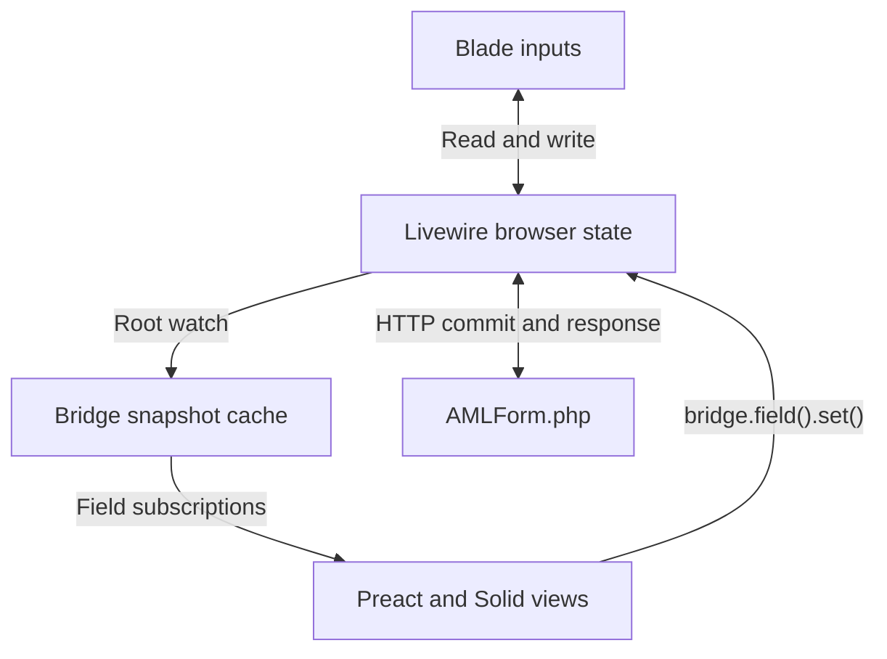

# Livewire Framework Bridge — Proof-of-Concept Specification

Date: 2026-09-16  
Status: implementation handoff; proposed design, not an implemented or browser-tested package  
Working name: `wire-bridge`  
Primary target: Livewire 4, Blade, Preact, and Solid; plain JavaScript with JSDoc

## 1. Goal

Build one page that renders the same form three ways: ordinary Blade/Livewire inputs, a Preact component, and a Solid component. All three use the browser state of **one mounted `AMLForm.php` Livewire component**. Editing any view updates the other views without requiring an HTTP request. Explicitly committing the form sends the shared state to PHP. Changes made by PHP propagate back to all three views.

The experiment should prove that Livewire can supply state, synchronization, and PHP actions to arbitrary frontend renderers through a small reusable adapter. No Livewire, Alpine, or frontend framework fork is permitted.

Passing `$wire` as a prop preserves its methods and property behavior, but does not connect one framework's dependency tracker to another. The adapter must explicitly translate Livewire changes into the consumer's subscription mechanism.

The result is a shared reactive store plus a PHP action gateway. Do not introduce a separate writable application store or an event protocol that replicates the form between views.

## 2. Scope and decisions

| Decision | Requirement |
| --- | --- |
| State owner | One Livewire component instance, with public array `$data` |
| Frontends | Blade and Preact first; Solid required before the PoC is complete |
| Core abstraction | Framework-independent bridge exposing cached snapshots, field bindings, subscriptions, and actions |
| Language | JavaScript/JSDoc; JSX for frontend views; PHP for the backend |
| Synchronization | Deferred local edits; explicit commit/action for HTTP |
| DOM ownership | Livewire owns wrappers; each frontend owns its `wire:ignore` host |
| State format | Plain JSON-compatible data; whole-value replacement for object/array writes |
| Storage | No database required; `save()` validates and records a demonstration save receipt in component state |
| Filament | Architectural reference and optional follow-up, not a runtime dependency |
| Packaging | Keep modules inside the Laravel application initially; do not publish an npm package |

Out of scope: Livewire 3 compatibility, SSR/hydration of the frontend islands, automatic dependency tracking for arbitrary property reads, cross-tab or multi-user collaboration, offline replay, uploads, Filament actions/modals, a complete validation adapter, schema-generated forms, and CRDT/conflict resolution.

Do not add configurable blur/debounce/live policies to the initial core. They can follow after deferred synchronization and lifecycle behavior are demonstrated. This keeps transport policy separate from binding correctness.

## 3. Compatibility baseline

The preceding source review inspected Livewire `4.x` at `ed7887161a63cf4817b5565e0968da24a385d334`. Its `$watch(path, callback)` returns an unsubscribe function. The inspected Livewire `3.x` implementation did not return one.

At implementation time:

1. Choose and lock a released Livewire 4 version containing the required behavior. Record the exact PHP, Laravel, Livewire, Preact, Solid, Node, and build-tool versions in the README.
2. Confirm `$get`, `$set(path, value, false)`, `$watch`, `$commit`, `$call`, and the documented custom-directive cleanup interface in that installed version.
3. Add a small compatibility test proving that a `$watch` subscription can be stopped while the Livewire component remains mounted.
4. If a suitable release lacks this behavior, explicitly document and pin a development revision for the PoC, or stop with a precise compatibility finding. Do not silently use private component fields or pretend that Livewire 3 is supported.

Use Livewire's bundled Alpine instance. Do not import/start a second Alpine runtime. Do not assume an independently bundled Vue reactivity engine shares Alpine's subscriptions.

## 4. Demo behavior

Route: `/poc/wire-bridge`.

Display three labeled panels: **Blade**, **Preact**, and **Solid**. Use the same field labels and a simple responsive layout. Add two inspectors beneath them:

- **Browser state:** a read-only JSON snapshot from the bridge, updated locally.
- **Last server-rendered state:** plain Blade-rendered JSON from PHP, changed only after a server render. Never bind this inspector to the bridge or Alpine browser state.

Provide controls to commit, normalize on the server, reset on the server, and save. Include local mount/unmount controls for the two frontend panels, plus a server-controlled wrapper toggle that removes and reintroduces a host during a Livewire morph. This tests both client cleanup and server-driven lifecycle changes.

Show PHP validation errors in a shared Blade-owned area. Frontend-specific validation styling is not required. Distinguish a validation failure from a request/network failure.

Display developer diagnostics in a collapsible area: mounted renderers, active bridges, root watchers, field subscribers, bridge revision, and bridge-originated requests in flight. These counters are demonstration instrumentation, not product UI or part of the stable bridge API. A Blade-originated request must not be mislabeled as a bridge-originated request.

### Demonstration sequence

1. Type a name in Blade. Preact and Solid update; the server inspector remains unchanged.
2. Change the country in Preact. Blade and Solid update without a request.
3. Toggle the checkbox and change a nested address value in Solid. Other views update.
4. Commit. PHP's inspector catches up.
5. Run `normalize()`. PHP trims the name and uppercases the country; all views show the result.
6. Replace the full `data` object through `resetForm()`. Existing subscriptions keep working.
7. Unmount Preact, edit in Solid, then remount Preact. It immediately displays current state.

## 5. Backend fixture

Create `app/Livewire/AMLForm.php` and `resources/views/livewire/aml-form.blade.php` using the normal class-based component conventions of the selected Laravel/Livewire versions.

Initial public data:

```php
public array $data = [
    'name' => 'Helge',
    'country' => 'NO',
    'isPep' => false,
    'address' => [
        'city' => 'Bergen',
        'postalCode' => '5000',
    ],
    'owners' => [
        ['id' => 'owner-1', 'name' => 'Helge', 'share' => 100],
    ],
];
```

`isPep` is a demonstration boolean for politically exposed person status. Use synthetic fixture data only; this PoC is not an AML decision system.

Required PHP actions:

| Action | Behavior |
| --- | --- |
| `normalize()` | Trim `data.name`, uppercase `data.country`, trim address strings; return a small serializable result |
| `resetForm()` | Replace the entire `$data` array with fresh defaults and clear validation errors |
| `save()` | Validate data, increment a public demonstration save count, record the validated data in a save receipt; no database write |
| `replaceOwners()` | Replace the owners array with a known fixture to exercise array/object snapshots |

Validate at least name required/string/max length, country two-character string, boolean PEP value, address strings, and owner name/share structure. Keep postal codes as strings. Convert number-input values deliberately; do not depend on HTML inputs returning numbers.

Use ordinary `wire:model` for the deferred Blade fields. Do not add `.live`, blur, or debounce modifiers in the baseline demo. This makes local state changes observable without network traffic.

The last-server-state inspector should render `json_encode($data, ...)` from PHP. A successful method invocation or commit does not imply a database save; label the save receipt accordingly.

## 6. Architecture



The bridge caches read-only projections of Livewire state. Those projections are not independent writable state. All writes go to `$wire`; every published snapshot is reread from `$wire`.

Create one bridge per mounted Livewire component and root property. Share that bridge between renderers. A second `AMLForm` component on the page must receive a separate bridge even though it uses the same PHP class and root path.

Use one deep `$wire.$watch('data', ...)` per bridge for this small form. Avoid adding one Livewire watcher per field. Within the bridge, notify field subscribers only when their selected values change. Per-path Livewire watchers and structural-sharing optimizations are future work if larger forms need them.

## 7. Public JavaScript contracts

These are proposed package contracts, not existing Livewire APIs. Express them in JSDoc typedefs and keep the implementation framework-independent.

```js
const bridge = createWireBridge(wire, { root: 'data' });
const name = bridge.field('name');

name.getSnapshot();                  // current immutable field value
const unsubscribe = name.subscribe(() => {
    console.log(name.getSnapshot());
});

await name.set('Ada');               // local Livewire edit; no HTTP
await bridge.commit();              // request server synchronization
await bridge.call('normalize');      // invoke PHP action

unsubscribe();
bridge.dispose();
```

### Bridge

| Member | Contract |
| --- | --- |
| `id` | Livewire component ID, read-only |
| `root` | Root property path, fixed for bridge lifetime; `data` in this PoC |
| `wire` | Original `$wire` object, returned unchanged as an escape hatch |
| `getSnapshot()` | Cached immutable snapshot of the root value |
| `subscribe(listener)` | Subscribe to root snapshot changes; return an idempotent unsubscribe function |
| `field(path)` | Return a stable cached field binding for a path relative to the root |
| `commit()` | Call `$wire.$commit()` and return its promise result; synchronize cache from the current `$wire` state when settled |
| `call(method, ...args)` | Call `$wire.$call(method, ...args)`; preserve its result/error; synchronize cache when settled |
| `dispose()` | Idempotently stop the watcher, silence queued callbacks, clear listeners and release cached bindings |

### Field binding

| Member | Contract |
| --- | --- |
| `path` | Relative path, such as `address.city` |
| `getSnapshot()` | Cached immutable selected value; referentially stable until this field changes |
| `subscribe(listener)` | Listener receives no arguments and rereads the snapshot; returns idempotent unsubscribe |
| `set(nextValue)` | Replace the field value through `$wire.$set(absolutePath, value, false)`; never make an HTTP request itself |

`field('')` means the entire root and can replace it. `field('owners')` selects the whole array. `field('owners.0.name')` uses a numeric array index; document that it follows the index after reordering, not the owner's identity. Dynamic repeater identity management is out of scope. Use stable `owner.id` keys for rendered lists.

The bridge does not support unrestricted selector functions in this PoC. Field paths are sufficient to prove dependency isolation and keep the API small.

### Path and value rules

- Support dot-separated property names and numeric array indices only. No bracket expressions or property names containing literal dots.
- Reject `__proto__`, `constructor`, and `prototype` segments, malformed segments, and attempts to escape the configured root.
- A disappeared path reads as `undefined`; `undefined` is a missing-path result, not an allowed stored value.
- Reject writes to missing descendant paths; add/remove/reorder members by replacing the containing object or array. Root replacement remains allowed.
- Accept null, booleans, strings, finite numbers, arrays, and plain string-keyed objects recursively.
- Reject functions, symbols, BigInt, dates/class instances, cyclic values, undefined members, and non-finite numbers with useful errors. Do not silently lose values through JSON serialization.
- Inputs from a framework are copied before being handed to `$wire`, so mutating the caller's original array later cannot mutate Livewire state behind the bridge.

No `new Proxy()` facade is required. A proxy cannot make Preact and Solid share a dependency tracker. Prove a clear `field/getSnapshot/subscribe/set` contract before considering syntactic sugar.

## 8. Snapshot and notification semantics

### Initialization

Register the root watcher, capture its disposer, then read and cache the current root. Verify the disposer is a function. Treat incompatibility as a visible initialization error, with cleanup of resources allocated so far.

The root watcher exists while the bridge is alive, even when no field listener is attached. This ensures a newly mounted renderer reads the latest cached value.

### Publication

Implement a private `refreshFromWire()` operation:

1. Exit immediately if the bridge was disposed.
2. Read `$wire.$get(root)` now. Do not publish an earlier value captured in a queued watcher callback.
3. Compare JSON-compatible values structurally. A simple recursive equality helper is sufficient; object key ordering should not count as a value change.
4. If unchanged, preserve snapshot identity and emit nothing.
5. Otherwise copy and freeze the new root snapshot and increment the local revision.
6. Recompute cached field selections. Preserve each field's prior snapshot reference if its selected value is structurally unchanged.
7. Update **all** caches before notifying any listeners.
8. Notify changed-field listeners and root listeners from a stable copy of their listener sets. Isolate a throwing listener so it does not prevent remaining listeners from receiving the change; report the failure.

`getSnapshot()` is a pure cache read. Never clone, allocate a new object, register a watcher, or initiate a request inside it. In development, freeze snapshots recursively to catch accidental mutation.

`subscribe()` does not invoke its listener immediately. Consumers read a snapshot and subscribe using their framework's appropriate external-store contract. Subscriptions must be safe to remove during notification.

### Local writes

`field.set(value)` validates and copies the value, calls `$wire.$set(absolutePath, value, false)`, and immediately refreshes from `$wire` after the synchronous local mutation. Return the resulting promise, reporting/rethrowing failures. The later queued root-watch notification is deduplicated by structural equality.

Never send the cached root object back just because one field changed. A scalar name edit must write `data.name`, not a potentially stale replacement of all `data`.

### Server changes

The root watcher observes server merges as well as local writes. `commit()` and `call()` also refresh after settlement to close scheduling gaps. Neither path writes a server snapshot back into `$wire`.

Do not label ordinary watcher notifications as definitively “from Blade” or “from PHP”: the subscription alone cannot reliably identify the source. A log can separately record bridge commands and observed state changes.

### Disposal

After disposal, queued callbacks do nothing. New subscriptions, reads, field lookups, writes, commits, and calls throw a clear disposed-bridge error. Calling an already-issued unsubscribe or `dispose()` remains safe. Existing in-flight Livewire requests are not canceled by disposing the bridge; their eventual results must not render through it.

## 9. Preact adapter

Use `useSyncExternalStore` from `preact/compat`. It provides the subscription/read lifecycle and closes the read-before-subscribe race.

The intended implementation is approximately:

```jsx
import { useMemo } from 'preact/hooks';
import { useSyncExternalStore } from 'preact/compat';

export function useWireField(bridge, path) {
    const binding = useMemo(() => bridge.field(path), [bridge, path]);
    const value = useSyncExternalStore(
        binding.subscribe,
        binding.getSnapshot,
    );
    return [value, binding.set];
}
```

Binding methods must be stable closures that do not require a `this` receiver. This supports passing them directly to hooks.

The form calls `useWireField(bridge, 'name')`, etc. Text inputs use `onInput`, checkboxes use `checked`, and numeric values are converted explicitly. For object edits, construct a new value and call `set()`; never mutate a snapshot.

The Preact renderer module exports `mount(host, bridge)` and returns `{ destroy() }`. Use Preact's own render/unmount APIs. Ordinary state changes travel through subscriptions, so this adapter does not require a Filament-style external `update(props)` method.

## 10. Solid adapter

Implement `createWireField(bridge, path)` inside an active Solid owner. It returns `[accessor, setValue]`.

```jsx
import { createSignal, onCleanup } from 'solid-js';

export function createWireField(bridge, path) {
    const binding = bridge.field(path);
    const [value, setValue] = createSignal(binding.getSnapshot());

    const sync = () => setValue(() => binding.getSnapshot());
    const unsubscribe = binding.subscribe(sync);
    sync(); // Close any initialization/subscription gap.
    onCleanup(unsubscribe);

    return [value, binding.set];
}
```

Keep the subscription direction explicit: external changes update the signal; user handlers call `binding.set()`. Do not add a Solid effect that automatically writes the signal back to Livewire, which would create an echo loop.

For this PoC the bridge/path are fixed for the binding's lifetime. Remount to change them. Supporting a reactive path accessor is future work.

The Solid renderer also exports `mount(host, bridge)` and returns `{ destroy() }`, using the disposer returned by `solid-js/web` rendering.

## 11. Mounting, bundling, and DOM ownership

Register a custom Livewire directive before Livewire initializes the page:

```blade
<div wire:ignore wire:frontend="preact" wire:key="aml-preact"></div>
<div wire:ignore wire:frontend="solid" wire:key="aml-solid"></div>
```

The directive name is proposed by this spec. Implement it using the documented `Livewire.directive()` callback arguments, including `component.$wire` and `cleanup`. Do not use `__instance`, `ephemeral`, `canonical`, or other private fields.

Directive behavior:

1. Acquire a bridge lease from a registry keyed by component ID plus root property. Reuse the bridge for sibling hosts.
2. Register cleanup immediately, before starting any asynchronous module import.
3. Load the selected renderer from a fixed application-owned map; no arbitrary URLs from attributes.
4. Mount only if the host is still alive.
5. On cleanup, mark the mount canceled, destroy its renderer, release the lease, and remove host bookkeeping. Make each step idempotent.
6. Dispose the bridge when its last lease is released. If an inspector also uses it, that inspector needs its own lease and cleanup.
7. If an asynchronous renderer resolves after removal, immediately destroy it and never attach or update its UI.

A `WeakMap` of host elements prevents accidental duplicate mounting. A disposed registry entry must be removed so remounting creates a fresh bridge over the still-current Livewire state.

The Livewire wrapper must retain stable keys through normal server renders. Put visibility conditions on a wrapper outside the ignored host. Do not let Blade render dynamic descendants inside a frontend-owned subtree. Backend error messages and inspectors stay outside that subtree.

Register initialization only once and make it work with `wire:navigate`. Verify script ordering explicitly; do not rely on an arbitrary timeout to wait for Livewire.

### JSX build isolation

Preact and Solid JSX use different transforms. Put them in separate directories and configure Vite plugin `include`/`exclude` rules so each `.jsx` file passes through exactly its own framework transform. Do not globally alias React to Preact or apply the Solid transform to Preact files. Record the exact build setup in the README.

Suggested source layout:

```text
app/Livewire/AMLForm.php
resources/views/livewire/aml-form.blade.php
resources/js/wire-bridge/core.js
resources/js/wire-bridge/json.js
resources/js/wire-bridge/registry.js
resources/js/wire-bridge/directive.js
resources/js/wire-bridge/preact/use-wire-field.js
resources/js/wire-bridge/solid/create-wire-field.js
resources/js/poc/preact/AMLForm.jsx
resources/js/poc/preact/mount.jsx
resources/js/poc/solid/AMLForm.jsx
resources/js/poc/solid/mount.jsx
resources/js/poc/inspector.js
tests/js/wire-bridge.test.js
tests/Feature/AMLFormTest.php
tests/browser/wire-bridge.spec.js
```

## 12. HTTP, errors, and concurrent edits

`set()` is always deferred. `commit()` requests synchronization. `call()` invokes PHP with whatever updates Livewire includes in that request. Do not manually construct Livewire requests, synthesize snapshots, or replay pending edits after responses.

Keep local edits visible if a request fails. Show a retryable request error; do not perform a homemade rollback. Validate how the installed Livewire version settles its promises for network errors and validation failures. A resolved `save()` request must not automatically become a “saved” toast: confirm the server-provided save receipt/count changed. PHP validation errors may be delivered through a normal Livewire response.

For the baseline controls, prevent double-clicked bridge actions while one is in flight. A rejected promise must clear that busy state. This is a demo interaction policy, not a new transport queue in the bridge. Blade actions still use Livewire's normal behavior.

**The bridge inherits Livewire's handling of edits during requests.** In particular, do not promise that a server normalization of a field and a newer local edit to that same field will always merge in the user's preferred order.

Add a slow-response characterization test: start `normalize()`, edit the same field before the response, and record the installed version's result. Repeat with a different field. The bridge must converge to the state exposed by `$wire`, without causing additional overwrites or writeback loops. Document any underlying lost-edit behavior as a limitation. A production conflict/rebase policy is a separate project.

## 13. Verification and acceptance criteria

Use a small unit suite for the bridge contract and a real Laravel browser suite for the behaviors that depend on Livewire. A fake `$wire` alone cannot establish that this integration works.

### Core unit checks

Use a test double implementing get/set/watch/commit/call and an explicit microtask notification queue. Cover stable snapshots, selective notifications, malformed values/paths, caller-owned object mutation, unsubscribe, disposal, and pending callbacks after disposal. Verify that local writes never call commit or a PHP action.

### Real-browser acceptance matrix

| ID | Scenario | Required result |
| --- | --- | --- |
| A1 | Edit Blade name | Both frontend views converge after reactive scheduling; zero Livewire update requests |
| A2 | Edit Preact country | Blade and Solid converge; zero Livewire update requests |
| A3 | Edit Solid checkbox/address | Boolean and nested string types remain correct in all views |
| A4 | Commit dirty state | One intentional Livewire synchronization request; PHP inspector matches current form |
| A5 | PHP normalize | All views receive changed values; no feedback request follows |
| A6 | PHP reset replaces root | Existing bindings still work; no remount required for ordinary root changes |
| A7 | Object/array edits | Changed bindings receive new immutable snapshots; unrelated field snapshots retain identity |
| A8 | PHP validation fails | Blade errors appear; edits remain visible; save count does not increase |
| A9 | Unmount/remount Preact | Its subscriptions disappear; Solid remains functional; remount reads current state |
| A10 | Remove wrapper through server morph | Exactly one destroy per mounted renderer; no zombie watcher callbacks |
| A11 | Remove host during lazy import | No late UI attachment; any completed mount is disposed |
| A12 | Navigate away/back | No duplicate roots/listeners; current instance has the expected bridge/watch count |
| A13 | Two AMLForm instances | Editing either instance leaves the other unchanged |
| A14 | Request failure and retry | No adapter rollback; busy clears; retry works according to Livewire behavior |
| A15 | Slow response with newer edits | Characterize Livewire result; bridge matches `$wire` and performs no extra writeback |
| A16 | Plain JavaScript observer | A non-framework subscriber sees the same changes and can unsubscribe |

Intercept only the application's Livewire update requests for network assertions. Disable polling and other unrelated requests in the fixture. Do not count static asset/module requests as server synchronization.

For local propagation tests, assert eventual UI convergence within a reasonable browser-test timeout; do not require all runtimes to render synchronously in the same call stack. Inspect counters or spies to prove notification isolation instead of relying only on screenshots.

After repeated mount/unmount cycles, live registry/watch/subscriber counts return to the appropriate baseline. Do not use a brittle raw heap-size threshold as the cleanup test.

## 14. Implementation sequence

1. **Fixture and compatibility:** scaffold the route, PHP component, Blade inputs, server inspector, and the installed-version API checks. Confirm deferred Blade updates independently.
2. **Core and plain-JS observer:** implement snapshots, root watch, field bindings, writes, and disposal. Prove the core without a frontend renderer.
3. **Preact:** implement the hook and mount lifecycle. Pass A1/A2/A4/A5/A6 with Blade plus Preact.
4. **Solid:** add its independently compiled renderer and signal adapter. Pass A3 and verify shared core usage.
5. **Lifecycle:** registry leases, late imports, server removal, navigation, multiple component instances.
6. **Errors and request characterization:** validation, failures, slow requests, and documented limitations.
7. **Handoff:** README, locked dependencies, automated test commands, and a short findings document.

If a stage exposes a Livewire limitation, isolate it in a minimal reproduction before adding bridge complexity. Do not solve a framework issue by reaching into private Livewire state.

## 15. Required implementation deliverables

- Runnable Laravel application or isolated addition to an existing Laravel app.
- Framework-independent bridge and both small framework adapters.
- Demonstration page with browser/server inspectors and lifecycle controls.
- Focused unit, PHP, and real-browser tests covering the matrix.
- README with install, build, serve, and test commands; exact version baseline; explanation of deferred writes and commit behavior.
- `findings.md` recording what worked, any installed-version differences, concurrency observations, and whether the adapter stayed small enough to justify extraction.

Done means all three views demonstrably share one Livewire state owner, PHP round trips work, subscriptions survive root replacement, cleanup is verified, and no framework or Livewire internals were patched. The slow-request test may identify a documented Livewire limitation; it must not be disguised as a bridge guarantee.

## 16. Optional next experiment: Filament

Only after the core PoC succeeds, create a small integration spike using a compatible Filament version or the explicitly pinned feature branch.

The inspected Filament PR uses an Alpine field state bridge, immutable renderer snapshots, `onChange`, and explicit renderer `update`/`destroy` methods. It also exposes the original `$wire` through utilities. Its field API and this bridge operate at different levels: Filament owns field-specific configuration and timing; this bridge observes general Livewire component state.

For Filament's own field value, preserve `props.onChange()` and `props.onBlur()` so its binding policies are respected. Do not replace them with raw bridge writes as an invisible implementation detail. A useful separate test is subscribing to a sibling field through the bridge for immediate local UI changes; resolve the sibling's absolute state path explicitly and scope the bridge accordingly.

Do not make the ordinary Livewire PoC depend on the proposed Filament feature being merged.

## 17. Source references

These links document the inspected foundation; the proposed bridge API above is our design. Source inspection occurred on September 15, with the pinned watcher and directive lifecycle rechecked on September 16. The Filament PR was open at the original inspection; its current merge/release status must be checked if implementing the optional spike.

- [Livewire component state and server merge](https://github.com/livewire/livewire/blob/ed7887161a63cf4817b5565e0968da24a385d334/js/component.js)
- [Livewire wire proxy and methods](https://github.com/livewire/livewire/blob/ed7887161a63cf4817b5565e0968da24a385d334/js/%24wire.js)
- [Livewire watcher and cleanup](https://github.com/livewire/livewire/blob/ed7887161a63cf4817b5565e0968da24a385d334/js/features/supportWatch.js)
- [Livewire model binding and request timing](https://github.com/livewire/livewire/blob/ed7887161a63cf4817b5565e0968da24a385d334/js/directives/wire-model.js)
- [Livewire JavaScript and custom-directive lifecycle](https://github.com/livewire/livewire/blob/ed7887161a63cf4817b5565e0968da24a385d334/docs/javascript.md)
- [Alpine reactivity engine setup](https://github.com/alpinejs/alpine/blob/e2e541252a38533284fbbcdcd5f9f68316ae0934/packages/alpinejs/src/index.js)
- [Filament JavaScript fields PR #20494](https://github.com/filamentphp/filament/pull/20494)
- [Filament field bridge implementation](https://github.com/filamentphp/filament/blob/a2c4bd1f46b4ceab6f4b389c8198c898ea315957/packages/forms/resources/js/components/js-field.js)
- [Filament host and entanglement implementation](https://github.com/filamentphp/filament/blob/a2c4bd1f46b4ceab6f4b389c8198c898ea315957/packages/forms/src/Components/Concerns/HasJsRenderer.php)
- [Filament renderer contracts and integration limits](https://github.com/filamentphp/filament/blob/a2c4bd1f46b4ceab6f4b389c8198c898ea315957/packages/forms/docs/22-custom-fields.md)
- [Preact external-store export](https://github.com/preactjs/preact/blob/main/compat/src/index.js)
- [Solid external subscription utility source](https://github.com/solidjs/solid/blob/b25c557754f2ced0d86490e6dbfded9b1745b663/packages/solid/src/reactive/observable.ts)

## 18. Coding-agent instruction

Implement this specification in order. Start with the compatibility and plain-JavaScript state-sharing proof, then add Preact and Solid. Keep the core in ordinary JavaScript with JSDoc. Preserve Livewire as the only writable form state owner. Use documented lifecycle APIs, keep request policy explicit, and run real browser tests before claiming the integration works. Record concrete source/version differences rather than silently broadening the scope or adding private-API workarounds.
